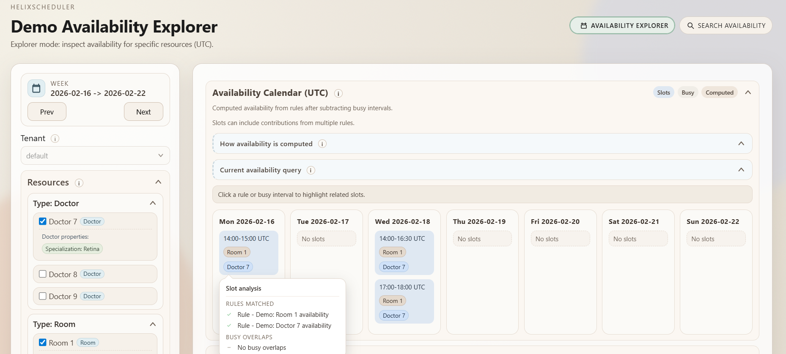
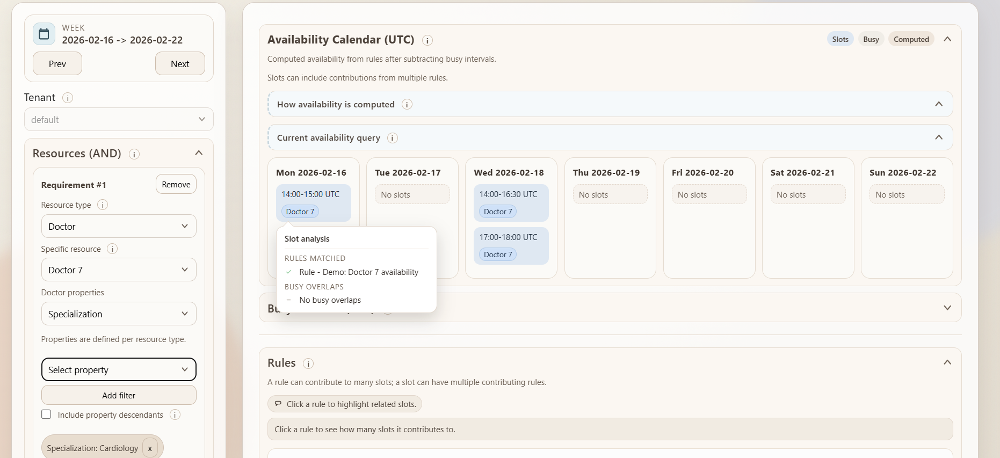

# HelixScheduler

**Deterministic scheduling engine for real-world resource planning on modern .NET**

HelixScheduler is designed to be the logical core of planning systems: the place where availability is defined once and computed correctly, even in the presence of complex rules, organizational hierarchies, concurrent capacity, and structural constraints.

Rendering a calendar is easy. Computing what can actually be shown is not.

---

# What Is HelixScheduler

HelixScheduler is a core scheduling engine designed to:

- model resource availability
- apply recurring rules and exceptions
- consider unavailability and real-world busy slots
- combine multiple resources together
- return truly usable time slots

Its purpose is to solve, in a coherent and explainable way, the most critical part of scheduling and booking systems:

> computing correctly when a combination of resources is actually available.

---

## Determinism

With the same inputs - rules, unavailability, busy slots, properties, and calculation options - the result is always identical.

The engine contains no heuristics, randomness, or implicit behavior. Computation is fully deterministic and verifiable.

This makes HelixScheduler suitable for:

- regulated environments
- critical systems
- contexts where reproducibility is essential

---

# Why HelixScheduler Exists

In real systems, availability depends on many entities:

- people
- spaces
- equipment
- facilities
- organizational constraints
- properties and qualifications

Implementing these rules directly on calendar events quickly leads to:

- duplication
- inconsistencies
- conflicts that are hard to detect
- non-scalable models

HelixScheduler separates availability logic from user interfaces and booking management.

The engine computes. The application decides how to use the result.

---

## Model Scalability

HelixScheduler does not pre-materialize events over time.

It does not generate future calendars or expand rules into persisted event lists.

The model relies on:

- a small set of structural rules
- normalized intervals
- dynamic busy slots

The number of rules typically remains limited and stable over time, even with many bookings.

Computation happens on demand, for an explicit time range.

This avoids:

- data explosions
- pre-generation of millions of records
- complex synchronization across duplicated events

The result is a system that is:

- lighter
- more coherent
- more predictable

---

# Core Concepts

## Resources

Everything is a resource:

- doctor
- room
- device
- site
- department
- machine
- team

Resources can be organized in hierarchical relations:

- Site -> Room
- Department -> Doctor
- Facility -> Clinic

You can request that the calculation also accounts for ancestor availability (`includeResourceAncestors`).

This enables proper modeling of:

- site closures
- organizational blocks
- structural constraints

Without duplicating unavailability on child resources.

---

## Rules

Rules define structural availability.

Examples:

- Mon-Fri 09:00-18:00
- Tuesdays only
- every first Monday of the month
- until a certain date
- no end date

Recurrence is optional: it is a feature, not a requirement.

---

## Unavailability

These fully block a resource.

Examples:

- vacations
- site closure
- maintenance

An unavailability is equivalent to capacity = 0 for that interval.

---

## Busy Slots

In real systems, busy slots derive from domain bookings and can be projected or sent to the engine as normalized input at calculation time.

They represent real resource usage.

A confirmed booking generates a busy slot.

Busy slots:

- consume capacity
- can coexist if capacity > 1
- prevent invalid overlaps

A busy slot can involve multiple resources at the same time.

For example, a visit requiring both a doctor and a room creates a coherent busy slot on both resources, ensuring the constraint is enforced atomically in the availability calculation.

---

## Capacity

Each resource can have a capacity.

Examples:

- doctor -> 1
- mobile ultrasound -> 1
- laboratory -> 3
- classroom -> 20

Availability is computed as:

Effective availability =
Availability from rules
- unavailability
- busy slots (up to capacity)

---

## Properties

Resources can have properties organized in categories and hierarchies.

Example:

Diagnostics
-> Ultrasound
-> X-ray
-> CT

With `includeDescendants` you can filter by a category and automatically include all specializations.

---

# Real-World Problems Solved

## Visit with doctor + room

A visit requires:

- a doctor
- a room

A slot exists only if both are available in the same interval (AND).

---

## Shared mobile equipment

A visit also requires a mobile ultrasound.

- capacity = 1
- shared across clinics

The slot exists only if:

doctor AND room AND ultrasound are available.

No double booking.

---

## Multiple equivalent rooms

There are multiple equivalent clinics.

It is enough that at least one room is available.

This is modeled as OR across alternative resources.

---

## Site closed for holidays

A room belongs to a site.

If the site is closed:

- no need to add unavailability on every room
- it is enough to set it on the site

With `includeResourceAncestors`, the constraint propagates automatically.

---

## Filtering by site characteristics

A visit requires:

- suitable room
- accredited site
- site in a specific area

Properties live on the site, not the room.

The engine can select only resources whose organizational context satisfies constraints, avoiding duplication.

---

# Querying Availability

Availability is requested by providing:

- time range (date range, always UTC, date-only)
- slot duration (`slotDurationMinutes`)
- required resources
- optional AND / OR groups
- property filters
- ancestor filters

The engine returns coherent slots.

---

## Slot duration and granularity

Availability is not returned as a continuous, indistinct interval.

Each request specifies:

- time range
- slot duration
- optional handling of remainder slot (`includeRemainderSlot`)

The engine splits the requested range into coherent windows and checks actual availability for each.

Including remainder slots is an explicit and optional decision left to the consumer.

---

## Explainability

The model clearly separates:

- rules
- unavailability
- busy slots
- filters

This makes it always possible to explain why a slot is available or not.

Availability is the result of an explicit combination of traceable elements.

Each slot derives from an explicit set of rules and negative intervals (unavailability and busy slots) that can be verified.

---

# Multi-tenant

HelixScheduler supports multi-tenant mode with data isolation at the Infrastructure layer.

Features:

- Tenants table with default seed
- Tenant identification via HTTP header (`X-Tenant`, `X-Helix-Tenant`)
- Automatic fallback to tenant `default`
- 404 response if the requested tenant does not exist
- EF Core global query filters for data isolation (row-level isolation via tenantId)
- No changes to the engine core

Each tenant has:

- its own resources
- its own rules
- its own unavailability
- its own busy slots
- isolated properties and relations

The engine remains deterministic and tenant-neutral.

---

# Architecture

- Core -> pure deterministic engine
- Application -> orchestration
- Infrastructure -> persistence and isolation
- WebApi -> HTTP exposure
- DemoWeb -> demo interface

The Core is independent from databases, HTTP, or external frameworks.

The engine can be fully tested in-memory, without a database or WebApi, enabling deterministic and reproducible unit tests.

---

# Technology Stack

HelixScheduler is built with:

- .NET 10
- C#
- Entity Framework Core
- ASP.NET Core Web API

Technical characteristics:

- Core completely independent of the framework
- Project-based architecture (Core / Application / Infrastructure / WebApi)
- SQL Server support
- Compatible with cross-platform environments (.NET runtime)

The engine can be used:

- embedded in .NET applications
- via HTTP WebApi
- in multi-tenant scenarios

---

# Quickstart

## Prerequisites
- .NET 10 SDK
- SQL Server (default provider)

## Database Setup
The default provider is SQL Server. Configure the connection string in `appsettings.json` or environment variables.

Example `appsettings.json`:
```json
{
  "ConnectionStrings": {
    "SchedulerDb": "Server=.\\SQLEXPRESS;Database=HelixScheduler;Trusted_Connection=True;TrustServerCertificate=True"
  },
  "HelixScheduler": {
    "DatabaseProvider": "SqlServer"
  }
}
```

Note: SQLite support is currently disabled by configuration. Use SQL Server.


## Migrations 

### 1. Apply database migrations (create/update the database schema)

```bash
dotnet ef database update --startup-project src/HelixScheduler.WebApi
```

This command creates or updates the database schema using EF Core migrations.
At this stage, the tables are created but contain no data.

---

### 2. Run the WebApi (demo seed runs automatically)

```bash
dotnet run --project src/HelixScheduler.WebApi
```

On startup (in non-`Testing` environments), the WebApi executes the demo seed and populates:

- Resources
- Scheduling rules
- Busy intervals
- Demo scenario state (relative to the first run date)

> The demo seed is intended for development and demonstration purposes.
> Disable or replace it for production usage.

---

### 3. Run the DemoWeb UI

Open a second terminal and run:

```bash
dotnet run --project src/HelixScheduler.DemoWeb
```

The DemoWeb project is a read-only UI that calls the WebApi and renders availability results.

---

### Running both projects in Visual Studio

If using Visual Studio:

1. Right click the solution → **Set Startup Projects...**
2. Select **Multiple startup projects**
3. Set:
   - `HelixScheduler.WebApi` → **Start**
   - `HelixScheduler.DemoWeb` → **Start**
4. Click **OK**
5. Press **F5**


---

# API Examples

### Compute availability (POST)
```bash
curl -X POST http://localhost:5000/api/availability/compute \
  -H "Content-Type: application/json" \
  -d '{
    "fromDate": "2026-01-05",
    "toDate": "2026-01-05",
    "requiredResourceIds": [1],
    "slotDurationMinutes": 30,
    "includeRemainderSlot": false
  }'
```

### Compute availability with tenant header
```bash
curl -X POST http://localhost:5000/api/availability/compute \
  -H "Content-Type: application/json" \
  -H "X-Tenant: default" \
  -d '{
    "fromDate": "2026-01-05",
    "toDate": "2026-01-05",
    "requiredResourceIds": [1],
    "slotDurationMinutes": 30,
    "includeRemainderSlot": false
  }'
```

### Compute with ancestors and OR groups
```bash
curl -X POST http://localhost:5000/api/availability/compute \
  -H "Content-Type: application/json" \
  -d '{
    "fromDate": "2026-01-05",
    "toDate": "2026-01-05",
    "requiredResourceIds": [1],
    "resourceOrGroups": [[2,3],[10,11,12]],
    "includeResourceAncestors": true,
    "ancestorRelationTypes": ["Contains"],
    "ancestorMode": "perGroup",
    "slotDurationMinutes": 30,
    "includeRemainderSlot": false
  }'
```

### Get slots (query string)
```bash
curl "http://localhost:5000/api/availability/slots?fromDate=2026-01-05&toDate=2026-01-05&resourceIds=1"
```

---

# Demo Application

HelixScheduler includes a DemoWeb application that showcases the engine in action.

The demo is intentionally:

- read-only
- free of scheduling logic in the frontend
- based exclusively on WebApi endpoints

This demonstrates that the engine is completely separated from the interface.

---

## Explorer

The Explorer page allows you to:

- navigate resources
- view hierarchical relations
- explore assigned properties
- understand the domain structure

It uses only catalog endpoints:

- `GET /api/catalog/resource-types`
- `GET /api/catalog/resources`
- `GET /api/catalog/properties`



---

## Availability Search

The Availability page allows you to:

- select a time range (UTC)
- set slot duration (`slotMinutes`)
- combine resources (AND / OR)
- apply property filters (`includeDescendants`)
- include ancestors (`includeResourceAncestors`)
- include or exclude remainder slots

It calls:

`POST /api/availability/compute`

It shows:

- resulting slots
- deterministic behavior as parameters change
- the effect of capacity, unavailability, and busy slots



---

## Interaction Flow

UI -> WebApi -> Application -> Core -> normalized result -> UI

The demo contains no computation logic.
All availability is produced by the engine.

---

# Project Status

The conceptual model is consolidated:

- resources
- rules
- unavailability
- busy slots
- capacity
- hierarchies
- semantic filters
- multi-tenant

HelixScheduler is designed to be integrated, extended, and maintained over time.

---

# Tests

```bash
 dotnet test
```

---

# License

Apache-2.0. See `LICENSE`.
